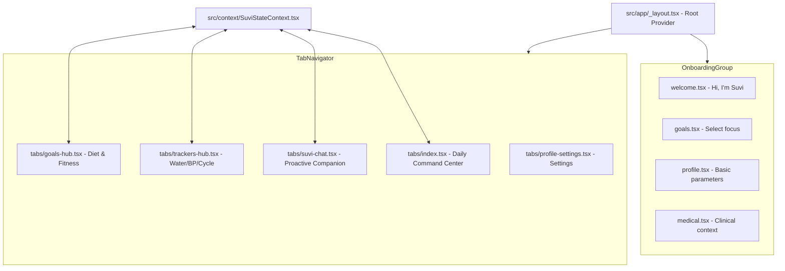

# SUVI Health App - React Native & Expo Mobile Companion

This updated implementation plan shifts our focus from a web-based HTML iframe simulator to a **production-ready native React Native + Expo Mobile Application**! 

We will translate the gorgeous visuals, liquid aurora designs, and layouts from your 45 designed HTML screens into highly responsive, fluid, and beautifully animated React Native screens.

---

## 1. Mobile-First System Architecture

We will structure the Expo app inside the `suvi-app/` directory using file-based routing with `expo-router` and a clean modular design.

### Core Architecture Components

1. **State Engine (`SuviStateContext.tsx`)**:
   - A unified React Context that acts as the "app's brain".
   - Handles mock device synchronization (Smartwatch rest heart rate, sleep tracking).
   - Manages daily entries: Water intake, blood pressure logs, menstrual cycle day.
   - Schedules and tracks Metformin/Metoprolol medication checks.
   
2. **Empathetic Proactive Advisor (Companion Engine)**:
   - Evaluates biodata dynamically to output personalized notifications.
   - *Example*: If sleep is < 6 hours and resting heart rate is elevated, it automatically pushes a notification warning to Today's Dashboard recommending lighter activities.
   - Tailors nutritional and recovery recommendations specifically to the cycle phase:
     - **Follicular Phase**: High energy, strength goals, complex carbs.
     - **Luteal Phase**: High recovery, stretching, warming foods, magnesium-rich diets.

3. **High-Fidelity Visuals (Sunset Glassmorphism & Reanimated Orb)**:
   - Build the iconic breathing mic orb in `react-native-reanimated` for smooth, native 60fps scale-and-glow animations.
   - Use high-quality gradient wrappers and frosted-glass panels (`expo-glass-effect` or semi-transparent backdrops with styled border borders) to reproduce the premium visual layout of your HTML mockups.

---

## 2. Detailed Onboarding & Mobile Screens Flow

We will implement the following core screens in React Native:

### Onboarding Flow (One-time Setup)
1. **Welcome Screen (`welcome.tsx`)**: Welcome to SUVI, the animated breathing core orb, transition to goals setup.
2. **Goals Selection (`goals.tsx`)**: Weight goals (gain/loss/maintenance), dietary plans, and medication schedules.
3. **Basic Profile (`profile.tsx`)**: User name, biological parameters.
4. **Medical Context & Sync (`medical.tsx`)**: Report upload scan mockup and smartwatch permissions mock integration.

### Tab Navigation (The Mobile Command Center)
1. **Today (Daily Command Center - `index.tsx`)**:
   - **Morning Brief Card**: Empathetic brief advising on sleep, heart rate, and schedule.
   - **Metrics Strip**: Interactive sliding cards for steps progress, medications check, water glasses logged, and workout recommendations.
   - **Proactive Suggestions**: Metoprolol refill countdown alerts and streak celebration cards.
2. **Suvi Companion Chat (`suvi-chat.tsx`)**:
   - Voice mic button with thinking/listening animation loop.
   - A rich dialog system simulating proactive speech: Suvi explains prescriptions (Amlodipine, Metformin), acts on reports, and builds meal plans.
3. **Trackers Hub (`trackers-hub.tsx`)**:
   - Navigates to **Menstrual Cycle Tracker** (with dynamic phase analysis & calendar logging), **Blood Pressure Monitor** (logs systolic/diastolic, tracks trends), and **Water Logger**.
4. **Goals Hub (`goals-hub.tsx`)**:
   - Workout checklists, diet trackers, and calorie counters.
5. **Profile Settings (`profile-settings.tsx`)**:
   - Connected devices (simulating Apple Watch / Fitbit sync toggles).

---

## 3. Open Questions & Tailored Logic

> [!IMPORTANT]
> Based on your preferences, we are designing:
> * **Menstrual Cycle Tracker integration**: Suvi will check your current cycle day and proactively add advice: *"Rahul (or female counterpart), you are in your luteal phase. Your body is working harder and resting heart rate might be slightly higher. Today, focus on recovery, warm herbal teas, and gentle stretching."*
> 
> **Further Design Decision Required**:
> 1. **Default Bio-Profile**: In the prototype, should we support switching between an onboarding profile for "Rahul" (focusing on diabetic medication tracking) and an onboarding profile for a female user (focusing on menstrual cycle-aware proactive recommendations)?
> 2. **Tailwind Styling**: Since Tailwind was used in the HTML codebase, would you prefer us to install and configure `nativewind` (Tailwind for React Native), or use standard React Native `StyleSheet` styling? *(Standard StyleSheet is highly recommended for smooth performance, exact gradients, and simpler layout rendering on all devices.)*

---

## 4. Proposed Changes

We will install necessary helper npm packages, set up the state engine, and implement the interactive components.

### Phase 1: Dependency Setup & Core State

#### [MODIFY] [package.json](file:///c:/Users/DELL/Desktop/PROJECTS/SUVI%20Health%20App/suvi-app/package.json)
- Add `@react-native-async-storage/async-storage` for persistence.
- Add `expo-linear-gradient` for premium fluid gradients.

#### [NEW] [SuviStateContext.tsx](file:///c:/Users/DELL/Desktop/PROJECTS/SUVI%20Health%20App/suvi-app/src/context/SuviStateContext.tsx)
- The global React context tracking user variables, smartwatch inputs, medication, logs, and period phase.

---

### Phase 2: Navigation & Onboarding Screens

#### [MODIFY] [welcome.tsx](file:///c:/Users/DELL/Desktop/PROJECTS/SUVI%20Health%20App/suvi-app/src/app/index.tsx)
- Recreate the boarding splash screen.
- Implement the premium breathing core orb using `react-native-reanimated` interpolations.

#### [NEW] [goals.tsx](file:///c:/Users/DELL/Desktop/PROJECTS/SUVI%20Health%20App/suvi-app/src/app/goals.tsx)
- Selected fitness goals and health metrics.

---

### Phase 3: The Connected Command Center & Interactive Chat

#### [NEW] [_layout.tsx](file:///c:/Users/DELL/Desktop/PROJECTS/SUVI%20Health%20App/suvi-app/src/app/(tabs)/_layout.tsx)
- Setting up bottom tabs (Today, Goals, Chat, Trackers, Profile) with material-symbol icons.

#### [NEW] [index.tsx](file:///c:/Users/DELL/Desktop/PROJECTS/SUVI%20Health%20App/suvi-app/src/app/(tabs)/index.tsx)
- The main daily dashboard. Subscribes to `SuviStateContext` to update step progresses, medication clicks, and water metrics in real-time.

#### [NEW] [suvi-chat.tsx](file:///c:/Users/DELL/Desktop/PROJECTS/SUVI%20Health%20App/suvi-app/src/app/(tabs)/suvi-chat.tsx)
- An interactive, stateful chat engine. Clicking suggested prompts triggers personalized AI responses.

---

## 5. Verification Plan

### Automated Build Validation
- Run `npx expo start` to make sure the app compiles and launches successfully.
- Verify typescript type safety by running `npx tsc --noEmit`.

### Manual Testing Flows
1. **Onboarding Complete**: Complete the welcome screen and goal selection, confirming profile state is correctly saved in memory.
2. **Dashboard Sync**: Log a glass of water or check a Metformin tablet on the Trackers tab, then switch to the Today tab to verify that metrics automatically increment and checkmarks persist.
3. **Empathetic Proactivity**: Simulate luteal phase or poor smartwatch sleep, confirming the Morning Brief updates its medical advisory.
